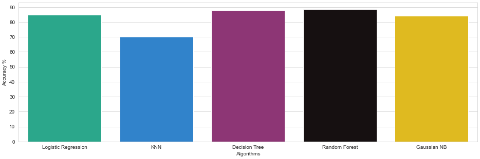

[README.md](https://github.com/AngelaDonguia/Data-4380/files/8767909/README.md)


# Heart Disease Prediction

**One Sentence Summary**

The repository performs serveral machine learning models to find out the best ML model for predicting heart disease, where the predictions are stored inside a csv file.

- [Heart Failure Predicition Dataset](https://www.kaggle.com/datasets/fedesoriano/heart-failure-prediction)

## Overview

The Notebook here contains the methods to perform ML models to find out heart problems.

- **Task:** The task for this notebook is to use all 12 features to make around 90% accurate prediction for heart disease, that is a combination of 5 health datasets.

- **The approach** The approach used for this notebook includes:
- - Preprocessing of Data: The data is cleaned and categorical values are replaced with numerical values (label encoding) to make the data more suitable for ML models.
- - Feature Engineering: The data is visualized to present the data more effectively with the help of the visualization libraries.
- - Modeling, Evaluating, and Predicitng: The data in the dataset is split into training and test sets. It uses 5 Machine Learning models, namely K-Nearest Neighbour (KNN), Random Forest, Decision Tree, Logistic Regression, and Gaussian NB, from which the best ML model is chosen to predict the heart disease and the data is written into a csv file.

- **Summary** The model is able to predict records of patients from a different dataset with around 90% accuracy and provides the ability to write data into a csv file. At the time of writing, this is the only notebook on the Kaggle Competition that automatically performs the ML models and then choses the best ML model itself to write the heart disease prediction.

## Summary of Workdone

Include only the sections that are relevant an appropriate.

### Data

- Type:
- - Input: CSV file of features, output: training and test sets
- - Input: CSV file for testing, output: csv file of patients with the prediction of heart disease
- Size: 36KB, 12KB
- Instances (Train, Test, Validation Split):
- - Trained 800 sample patients
- - Tested 200 sample patients
- - Predicted results of 300 patients (seperate from the training/testing set)

#### Preprocessing / Clean up

- Missing Values: Removing the missing values.
- Label Encoding: Replacing the categorical values such as 'M' or 'F' with numerical values that is '0' and '1'.

#### Data Visualization

Visulization is performed to present data in a more effective way of recognizing the data, first by bar chart to show sample variation and then by categorizing data based on patients having heart disease and not.

### Problem Formulation

- Input / Output: Two CSV files are used as inputs for this notebook. One notebook (used for Training/Testing) contains 919 patient records, while the other (used for prediciting results) has 304 patient records.

- Models: The models used in this notebook are K-Nearest Neighbour (KNN), Random Forest, Decision Tree, Logistic Regression, and Gaussian NB.
- - KNN: KNN model helps to find the nearest neighbours of a patient and then predicts the heart disease of the patient.
- - Random Forest: This model helps in selecting the best features of the patient to predict the heart disease of the patient.
- - Decision Tree: Decision Tree Model uses DT Algorigthm to find the best features of the patient.
- - Logistic Regression: Logistic Regression is a supervised ML model, such that it takes target variable y with indepenedant X features as part of being a Regression Model.
- - Gaussian NB: Gaussian Naive Bayes is a Naive Bayes classifier, which is a supervised learning algorithm used for classification problems.

- The optimizers are not put to use in this notebook due to models showing signs of less accuracy.

### Training

- Describe the training:

  - The training models was splitted into training and testing sets.
  - Each Machine Learning model was trained on the training set to find the optimal parameters.
  - For each machine learning model, there is a graph of the accuracy of the model to show accuracy per iteration.
  - ML model With the highest accuracy, the model was chosen to predict the heart disease of the patient.

### Performance Comparison

**Key Performance Indicators**

- Accuracy: The accuracy of the model is calculated by comparing the predicted heart disease of the patient with the actual heart disease of the patient.

- Precision: Precision is the ratio of the true positives to the true positives and false positives.

- Recall: Recall is used to measure the ability of the classifier to find all the positive samples.

- F1 Score: The F1 score is calculated by combining the precision and recall of a classifier into a single metric by taking their harmonic mean.

- Support: The support is the number of occurrences of a particular class in the training data.

**Comparing results**

- No Heart Disease

| Model               | Accuracy | Precision | Recall | F1 Score | Support |
| :------------------ | :------: | :-------: | :----: | :------: | :-----: |
| KNN                 |  70.11%  |   0.62    |  0.71  |   0.67   |   77    |
| Random Forest       |  88.59%  |   0.86    |  0.88  |   0.87   |   77    |
| Decision Tree       |  88.04%  |   0.73    |  0.83  |   0.78   |   77    |
| Logistic Regression |  84.78%  |   0.77    |  0.88  |   0.82   |   77    |
| Gaussian NB         |  84.24%  |   0.79    |  0.84  |   0.82   |   77    |

- Heart Disease

| Model               | Accuracy | Precision | Recall | F1 Score | Support |
| :------------------ | :------: | :-------: | :----: | :------: | :-----: |
| KNN                 |  70.11%  |   0.77    |  0.69  |   0.73   |   107   |
| Random Forest       |  88.59%  |   0.91    |  0.90  |   0.91   |   107   |
| Decision Tree       |  88.04%  |   0.86    |  0.78  |   0.82   |   107   |
| Logistic Regression |  84.78%  |   0.91    |  0.81  |   0.86   |   107   |
| Gaussian NB         |  84.24%  |   0.88    |  0.84  |   0.86   |   107   |

**Result of Comparison**
This is the result of the compared models in graphical representation


### Future Work

- What would be the next thing that you would try.

- - A multi-platform application that can take records from doctors or users and returns a CSV file of predictions with an accuracy report.

- What are some other studies that can be done starting from here.

- - How models can be taken to a further level?

- - Why Random Forest algorithm provides the highest predictive ratio than the rest?

- - Would using optimizers provide a better accurracy on unused ML Models?

## How to reproduce results?

- In the section "Reading Dataset" of the notebook, users/developers can:
- - Add their own model to be trained under the variable `df` and `df_v2`
- - - Set the Columns inside the column variable.

- - Add the model _to be predicied_ on variable `df_v3`.

- The rest will be handeled by the model to perform every operation on its own.

(**Note:** It is important to note that the required 11 features are present for the prediction to work.)

### Overview of files in repository

**Required Files**

- Heart_Desiease.ipynb: Contains training and testing of all the models with feature engineering, numerical analysis, and data analysis.
- heart-1.csv: Trains and test this dataset with the best model to make predictions on the other datasets.
- heart.csv: Predictions are made on this dataset and results are saved in a seperate file.

**Exported Files**

- prediction.csv: Contains prediction of `heart-1.csv` file.
- prediction-2.csv: Contains prediction of `heart.csv` file.

### Software Setup

**Required packages**

- numpy
- pandas
- matplotlib
- seaborn
- warnings
- sklearn
- - LabelEncoder
- - train_test_split
- - classification_report
- - confusion_matrix
- - KNeighborsClassifier
- - RandomForestClassifier
- - DecisionTreeClassifier
- - LogisticRegression
- - GaussianNB

**Installing packages**
Packages can be installed with the following command:

```
pip install numpy pandas matplotlib seaborn sklearn
```

**Adding packages**

```
import numpy as np
import pandas as pd
import matplotlib.plot as plt
import seaborn as sn
import warnings

from sklearn import LabelEncoder, train_test_split, classification_report, confusion_matrix, KNeighborsClassifier, RandomForestClassifier, DecisionTreeClassifier, LogisticRegression, GaussianNB
```
